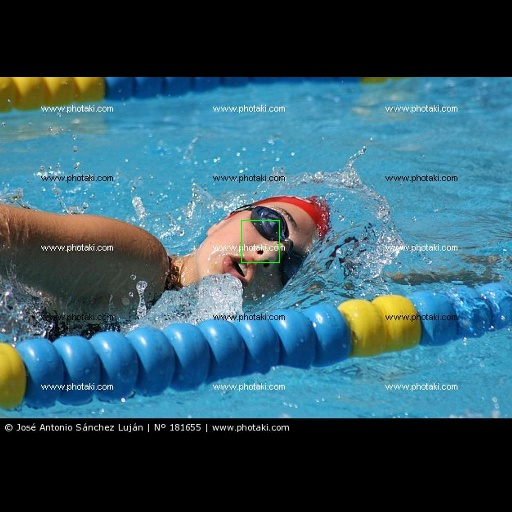

# Face Project
Digital Media Technique Project(Peking University)

## Introduction
The project is the term project of Digital Media Technique Course of Peking University. The target is to implement a system to detect face regions in the photos and identify the corresponding people from the database. My main contribution is to implement the detection module using deep learning.

## Network Architecture
The deep neural network I implement is based on U-Net, and modified with residual block. You can refer to [graph-run.png](Detection/graph-run.png) to find the detail of the architecture.

The code is implemented with Tensorflow rc0.11, without any other third-party libraries.

## Usage
The main code is in the **code** folder. The **test** folder is similar to training process, except that it is used for test an image.

**generate_dataset.py** helps generate tfrecords-format inputs.

**resfcn_input.py** copes with the input and preprocesses the image.

**resfcn_input.py** copes with the input and preprocesses the image.

**resfcn_model.py** establishes the model.

**resfcn_config.py** prepares all the configuration.

**resfcn_train.py** provides interfaces for training.

## Illustrations
We comapre our results with [SeetaFace](https://github.com/seetaface/SeetaFaceEngine/tree/master/FaceDetection) quantitively.
SeetaFace uses blue bounding boxes and ours use green ones. More comparision could be found in the repository.

  
  

  
  

  
  

